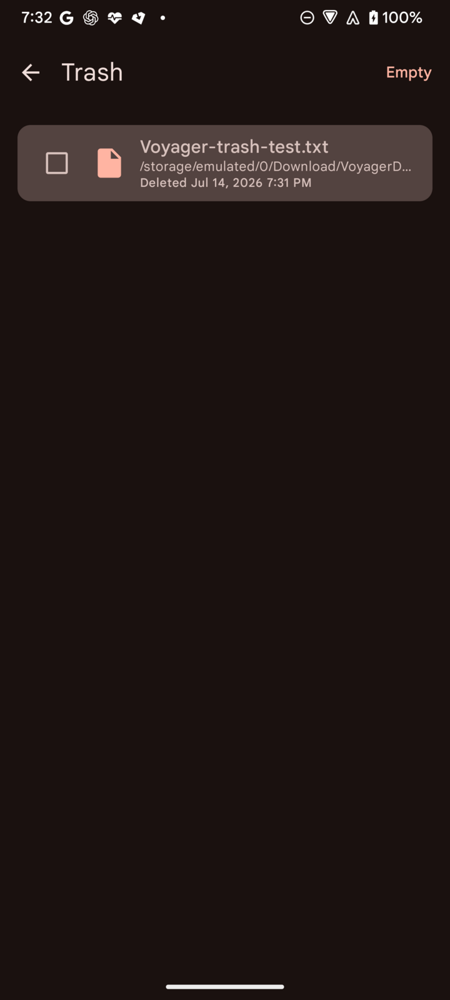

<div align="center">


# Voyager

An open-source Android file manager for local storage, document trees, SFTP, FTP, SMB, and WebDAV.

[](https://github.com/AlanHuang99/Voyager/actions/workflows/build.yml)
[](LICENSE)
[](https://github.com/AlanHuang99/Voyager/releases/latest)

[](https://f-droid.org/packages/com.voyagerfiles/)

</div>

## Screenshots

<p align="center">
  
  
  
</p>

## Features

- Browse internal storage and mounted external volumes such as SD cards and USB/OTG media.
- Continue without broad storage access and use Storage Access Framework document trees or remote servers in limited mode.
- Switch among list, compact list, and grid layouts, view image thumbnails, show hidden files, sort by name, size, date, or type, and search the current folder.
- Filter a folder by directories, images, videos, audio, documents, archives, or Android packages.
- Select visible results, share local or document-tree files, inspect file details, copy, move, rename, delete, and create files and folders, including cross-provider transfers.
- Choose Trash or permanent deletion for each direct-local operation, restore recoverable per-volume Trash items, or disable Trash in Settings.
- Bookmark local folders, open common media locations, and keep several local, document-tree, or remote browser sessions open.
- Connect to SFTP, FTP, SMB, and WebDAV servers and download remote files or directories to Android's Downloads folder.
- Authenticate to SFTP with a password, keyboard-interactive authentication, a private key file, or an in-app generated key pair.
- Choose from 20 included color schemes, including AMOLED black and high-contrast options, with Material You dynamic colors on Android 12 and later.

Network connections are user-initiated. The app contains no analytics or tracking, and local browsing needs no network access.

## Storage and security

Full local browsing uses Android's all-files special access. If that access is denied, Voyager remains usable for document trees and remote servers. The Home and Settings screens explain the active access mode and provide a route back to Android's permission settings.

Saved remote passwords are encrypted with AES-GCM using a device-bound Android Keystore key. The connection database, settings, generated SSH keys, and SFTP known-host data are excluded from Android cloud backup and device transfer. SFTP uses trust on first use and rejects a server whose saved host key changes.

SFTP and HTTPS WebDAV provide transport encryption. FTP is unencrypted, HTTP WebDAV is unencrypted, and Voyager does not force SMB transport encryption; the connection editor warns before saving cleartext FTP or HTTP WebDAV. Use unencrypted protocols only on an isolated trusted network.

## Requirements

- Android 8.0 (API 26) or later.
- A compatible server for remote browsing features.

## Install

- **F-Droid:** install from [f-droid.org/packages/com.voyagerfiles](https://f-droid.org/packages/com.voyagerfiles/).
- **GitHub:** download the latest `voyager-v<version>-universal.apk` or a matching per-ABI APK from the [Releases page](https://github.com/AlanHuang99/Voyager/releases/latest).

## Build from source

Prerequisites are JDK 17 and an Android SDK with compile SDK 35.

```bash
git clone https://github.com/AlanHuang99/Voyager.git
cd Voyager
./gradlew assembleDebug
```

Debug APKs are written to `app/build/outputs/apk/debug/`. The debug application ID is `com.voyagerfiles.debug`, so it can coexist with a release installation.

Run the complete local gate before submitting a change:

```bash
./gradlew testDebugUnitTest lintDebug assembleDebug assembleRelease
```

See [docs/TESTING.md](docs/TESTING.md) for device and protocol testing, [docs/ARCHITECTURE.md](docs/ARCHITECTURE.md) for the app structure and security boundaries, and [docs/RELEASE.md](docs/RELEASE.md) for release mechanics.

## Tech stack

| Area | Library |
| --- | --- |
| UI | Jetpack Compose, Material 3 |
| Navigation | Navigation Compose |
| Persistence | Room, DataStore Preferences, Android Keystore |
| SFTP | JSch (mwiede fork) |
| FTP | Apache Commons Net |
| SMB | smbj |
| WebDAV | Sardine-android and OkHttp |
| Images | Coil |
| Concurrency | Kotlin Coroutines |

All runtime dependencies are open source and license-compatible with GPLv3; the app ships with no proprietary libraries.

## Contributing

Issues and pull requests are welcome. For substantial changes, open an issue first to discuss the approach. Include automated coverage for changed behavior and describe any device or server setup used for manual verification.

## License

Voyager is licensed under the [GNU General Public License v3.0](LICENSE).
