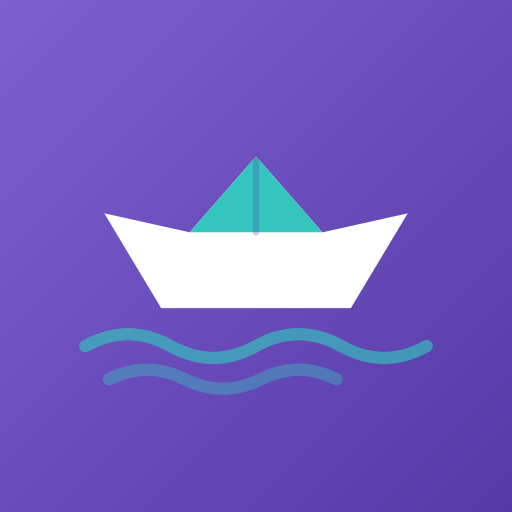
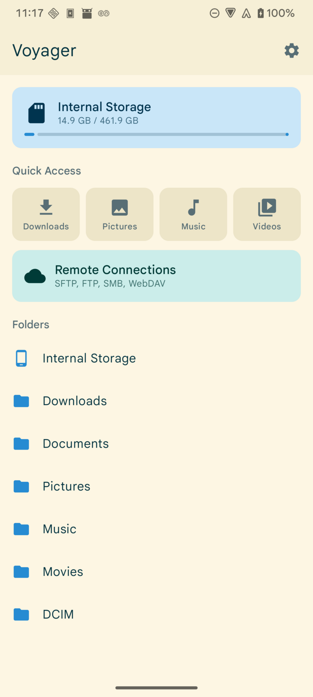
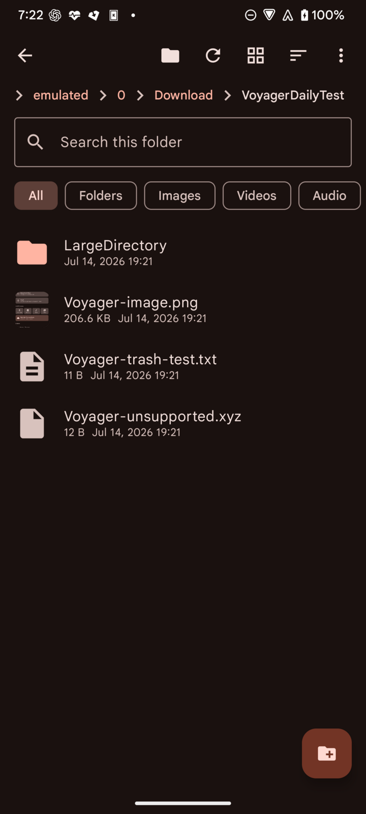
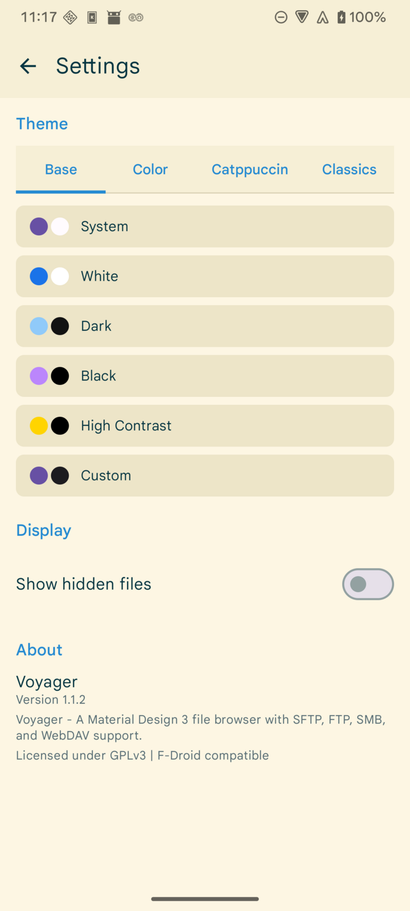

<div align="center">



# Voyager

An open-source file manager for Android with built-in SFTP, FTP, SMB, and WebDAV access.

[](https://github.com/AlanHuang99/Voyager/actions/workflows/build.yml)
[](LICENSE)
[](https://github.com/AlanHuang99/Voyager/releases/latest)

[](https://f-droid.org/packages/com.voyagerfiles/)

</div>

## Screenshots

<p align="center">
  
  
  
</p>

## Features

- Browse local storage with list and grid views, sorting, search, and a hidden-file toggle.
- Connect to remote servers over SFTP, FTP, SMB, and WebDAV.
- Authenticate to SFTP with a password, keyboard-interactive, or a private key file.
- Copy, move, rename, delete, and create files and folders, including between local storage and a remote server.
- Download remote files and folders to the device.
- Open several browser sessions at once, for local and remote locations, with a session switcher.
- Bookmark folders and reach common locations from Quick Access on the home screen.
- List mounted external storage volumes, such as SD cards and USB/OTG, alongside internal storage.
- Choose from 20 built-in themes, including an AMOLED black theme and a custom theme, with Material You dynamic color on Android 12 and later.

Network connections are user-initiated. The app contains no analytics or tracking, and local browsing needs no network access.

## Requirements

- Android 8.0 (API 26) or later.
- For remote features, access to an SFTP, FTP, SMB, or WebDAV server.

## Install

- **F-Droid:** available at [f-droid.org/packages/com.voyagerfiles](https://f-droid.org/packages/com.voyagerfiles/).
- **APK:** download the latest `voyager-<version>-universal.apk` (or a per-ABI variant) from the [Releases page](https://github.com/AlanHuang99/Voyager/releases/latest).

The F-Droid build and the GitHub release APKs are signed with the same key, so either can be installed over the other.

## Build from source

Prerequisites: JDK 17 and the Android SDK (compile SDK 35).

```bash
git clone https://github.com/AlanHuang99/Voyager.git
cd Voyager
./gradlew assembleDebug
```

Debug APKs are written to `app/build/outputs/apk/debug/` (a universal APK plus per-ABI variants). To install to a connected device:

```bash
./gradlew installDebug
```

The release build runs without signing secrets and produces unsigned APKs; signing is applied only when the release keystore is configured. Release and F-Droid mechanics are documented in [docs/RELEASE.md](docs/RELEASE.md).

## Tech stack

| Area | Library |
| --- | --- |
| UI | Jetpack Compose, Material 3 |
| Navigation | Navigation Compose |
| Persistence | Room, DataStore Preferences |
| SFTP | JSch (mwiede fork) |
| FTP | Apache Commons Net |
| SMB | smbj |
| WebDAV | Sardine-android |
| Images | Coil |
| Concurrency | Kotlin Coroutines |

All runtime dependencies are open source and license-compatible with GPLv3; the app ships with no proprietary libraries.

## Contributing

Issues and pull requests are welcome. For anything substantial, please open an issue first to discuss the approach.

Verify a change before opening a pull request:

```bash
./gradlew testDebugUnitTest lintDebug assembleDebug assembleRelease
```

## License

Voyager is licensed under the [GNU General Public License v3.0](LICENSE).
