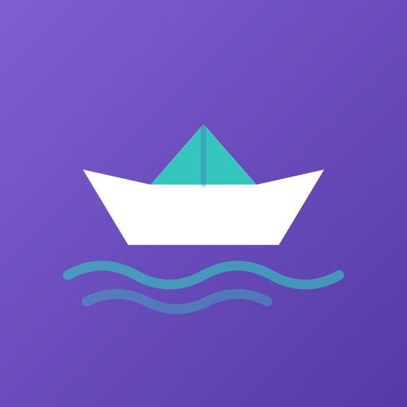
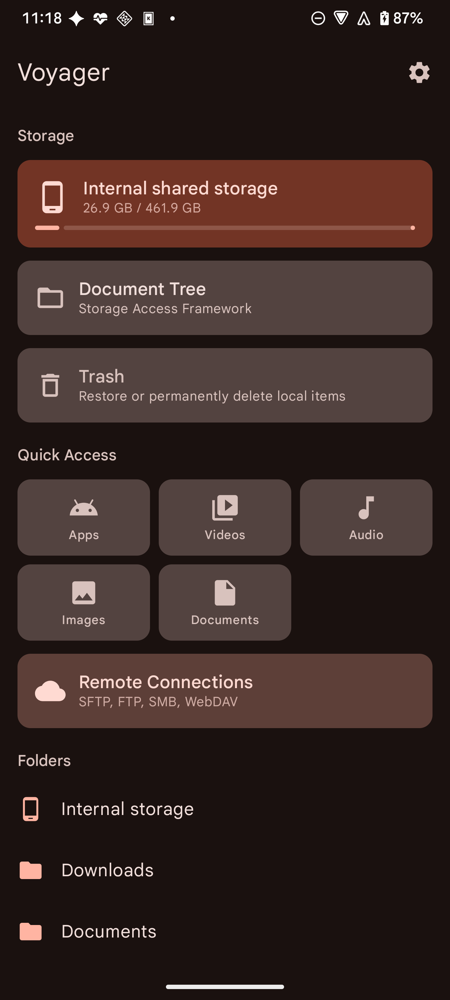
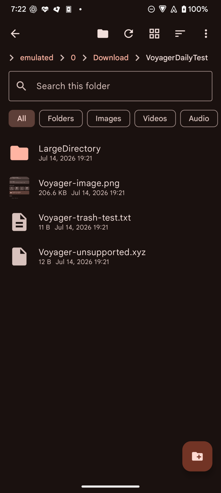
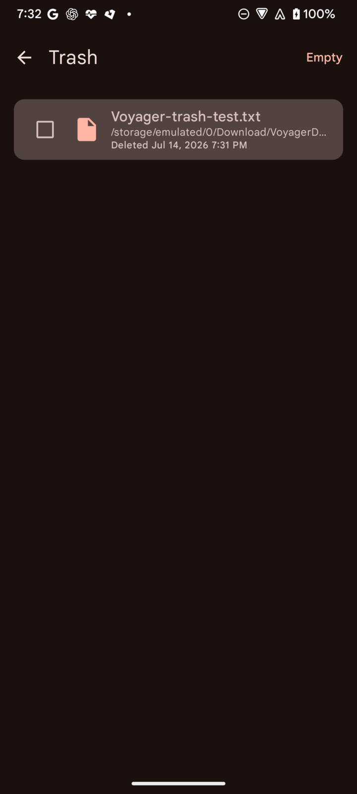

<div align="center">



# Voyager

An open-source Android file manager for local storage, document trees, SFTP, FTP, SMB, and WebDAV.

[](https://github.com/AlanHuang99/Voyager/actions/workflows/build.yml)
[](LICENSE)
[](https://github.com/AlanHuang99/Voyager/releases/latest)

[](https://f-droid.org/packages/com.voyagerfiles/)

</div>

**Help translate Voyager:** [Join the Crowdin project](https://crowdin.com/project/voyagerandroid). Translate a few strings or review wording in your browser. No coding or local build is required.

## Install

Requires **Android 8.0 or later**.

- **F-Droid:** install from [Voyager on F-Droid](https://f-droid.org/packages/com.voyagerfiles/).
- **GitHub:** download `voyager-v<version>-universal.apk` from the [latest release](https://github.com/AlanHuang99/Voyager/releases/latest). Smaller APKs for individual CPU architectures are also available.

F-Droid verifies releases through its own build process, so a new GitHub release can appear there later. Both distribution paths use the same developer signing key. APK checksums are included in each GitHub release as `SHA256SUMS.txt`; see [Verify your download](#verify-your-download) for the signing fingerprint.

## Screenshots

<p align="center">
  
  
  
</p>

## Get started

1. Open a storage location from Home. Grant Android's all-files access to browse shared storage, or continue in limited mode and choose a folder through Android's folder picker.
2. Tap a folder to browse or a file to open it. Search filters the current folder; type filters and sorting help narrow the list.
3. Long-press an item to select it, then use the available actions to copy, move, share, rename, or delete. Direct-local deletions can go to Trash for later restoration.
4. Add a connection for a remote server. SFTP, FTP, and SMB file taps ask before downloading by default. WebDAV can open files in another app directly when the server supports the required byte ranges.

Settings lets you choose the search position, theme, Home sections, and remote download behavior. Use the browser's view controls to switch between list and grid layouts, and its Sessions sheet to switch between open locations without returning to Home.

## Features

- Browse internal storage, SD cards, USB/OTG volumes, and folders granted through Android's folder picker.
- Copy, move, rename, create, and delete files across local, document-tree, and remote locations, with transfer progress and cancellation. Share local and document-tree files through Android's share sheet.
- Use list, compact list, or grid views, thumbnails, sorting, current-folder search, and file-type filters.
- Browse Home media categories, bookmark local folders, and keep multiple browser sessions open.
- Restore direct-local files from Trash and find duplicate files by content, with configurable folder exclusions.
- Create ZIP archives and extract ZIP, TAR, TGZ, TBZ2, GZ, and BZ2 archives with progress and cancellation.
- Connect to SFTP, FTP, SMB, and WebDAV. SFTP supports passwords, private keys, and generated key pairs; SMB can discover disk shares.
- Open files with Android's registered apps, including direct WebDAV playback when the server supports seeking.
- Choose among 20 included color schemes, custom themes, and Material You dynamic colors on Android 12 or later.
- Navigate with Android TV remote controls, or use an explicitly authorized root session on a compatible rooted device.

## Privacy and access

Voyager contains no analytics or tracking. Local browsing works without internet access; network connections are user-initiated. Remote passwords are encrypted with a device-bound Android Keystore key, and saved connections and SSH keys are excluded from Android backup and device transfer.

SFTP remembers server host keys and rejects unexpected changes. HTTPS WebDAV validates certificates through Android's trusted authorities. FTP and HTTP WebDAV are unencrypted. Ordinary local browsing never requests root; root sessions require confirmation and authorization through your device's `su` manager.

See [Architecture and security](docs/ARCHITECTURE.md) for storage, authentication, and file-operation details.

## Help translate

1. [Open Voyager on Crowdin](https://crowdin.com/project/voyagerandroid), sign in, and choose your language.
2. Open `strings.xml` and translate an untranslated string or improve an existing translation.
3. Keep placeholders such as `%1$s` and plural forms intact. Leave a comment on the string if its context is unclear.

You can also reach Crowdin through **Settings > About > Help improve translations**. Some languages contain provisional wording and show a dismissible notice in the app. Reviewed corrections reach installed apps through subsequent releases.

The [translation guide](docs/TRANSLATING.md) explains terminology, formatting, review, and synchronization. Request another language or offer language review in [GitHub Discussions](https://github.com/AlanHuang99/Voyager/discussions).

## Help and contribute

- **Questions and usage tips:** [GitHub Discussions](https://github.com/AlanHuang99/Voyager/discussions).
- **Bug reports:** [GitHub Issues](https://github.com/AlanHuang99/Voyager/issues). Include the app and Android versions, steps to reproduce, and the storage or server type involved. Remove personal filenames and connection details from screenshots.
- **Translations and language review:** [Crowdin](https://crowdin.com/project/voyagerandroid).
- **Code, documentation, and testing:** read [CONTRIBUTING.md](CONTRIBUTING.md). For a substantial feature, discuss the scope in an issue before starting.

Voyager focuses on file browsing and management. Proposals should keep everyday navigation clear and avoid adding unnecessary setup or controls.

## Build from source

Install JDK 17 and an Android SDK with compile SDK 35, then run:

```bash
git clone https://github.com/AlanHuang99/Voyager.git
cd Voyager
./gradlew assembleDebug
```

Debug APKs are written to `app/build/outputs/apk/debug/`. The debug application ID is `com.voyagerfiles.debug`, so it can coexist with the release app.

Before submitting code, run:

```bash
./gradlew testDebugUnitTest lintDebug assembleDebug assembleRelease
```

See [Testing](docs/TESTING.md) for device and protocol checks, [Architecture](docs/ARCHITECTURE.md) for the Kotlin and Compose app structure, and [Release process](docs/RELEASE.md) for GitHub and F-Droid distribution.

## Verify your download

The developer signing certificate has this SHA-256 fingerprint:

```text
db496277d456751abe8ca6405026337c81a561a134e38d49c8e21fb8f036badf
```

This identifies the signing certificate. Individual APK file checksums are listed in the release's `SHA256SUMS.txt`.

## License

Voyager is licensed under the [GNU General Public License v3.0](LICENSE).
